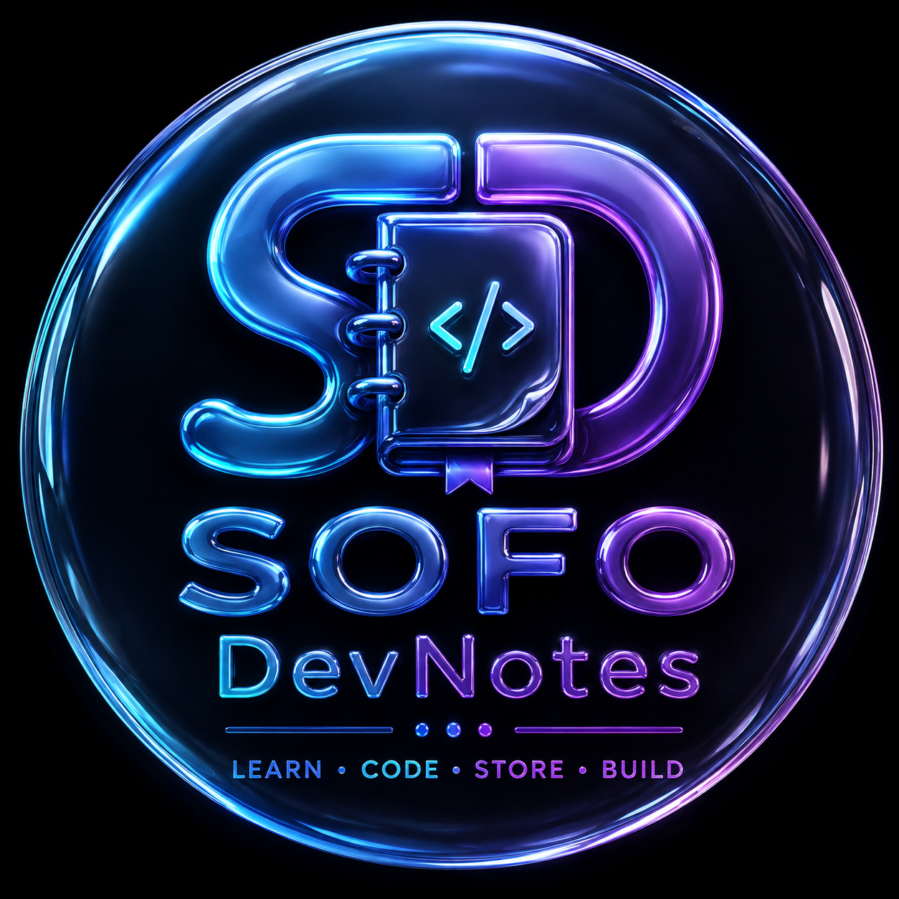

# 💻 SOFO DevNotes — Developer Knowledge Operating System

<div align="center">

  

  # **SOFO DevNotes**
  **Learn • Code • Store • Build**

  [](https://nextjs.org/)
  [](https://reactjs.org/)
  [](https://tailwindcss.com/)
  [](https://github.com/suren-atoyan/monaco-react)
  [](https://sofo-dev-backend.onrender.com/api/health)

  **Frontend Web App**: [`https://sofo-dev-notes.onrender.com`](https://sofo-dev-notes.onrender.com)  
  **Live Backend API**: [`https://sofo-dev-backend.onrender.com/api`](https://sofo-dev-backend.onrender.com/api)

</div>

---

## 🏗️ System Architecture & Data Flowchart

```mermaid
flowchart TD
    subgraph Client ["💻 Client Layer (Browser)"]
        User(["👤 User (Team Leader)"])
        Frontend["⚛️ SOFO DevNotes Frontend (Next.js 14 / React 18)"]
        Monaco["📝 Monaco Code Editor & Markdown Workspace"]
    end

    subgraph Auth ["🔒 EMS Dedicated Authentication"]
        EMS["🏢 EMS Remote API (https://erp-backend-1-02lc.onrender.com)"]
        TLGuard{"🛡️ Department Guard: Is Team Leader?"}
    end

    subgraph Backend ["⚡ Backend API Layer (Render.com)"]
        Express["🚀 Express.js REST API (https://sofo-dev-backend.onrender.com)"]
        AuthCtrl["🔑 authController (Identity & Password)"]
        SyncService["🔄 Code-to-File Auto Sync Engine"]
    end

    subgraph Database ["🗄️ Persistence Layer"]
        CockroachDB[("🐘 CockroachDB Labs (Cloud PostgreSQL)")]
        Languages["📚 36 Pre-seeded Languages"]
        Topics["💡 Topics, Notes, Files & Terminal Outputs"]
    end

    User -->|Enter Employee ID & Password| Frontend
    Frontend -->|POST /api/auth/login| Express
    Express --> AuthCtrl
    AuthCtrl -->|Verify Credentials| EMS
    EMS -->|Return Employee Metadata| TLGuard
    TLGuard -->|Yes (Department: Team Leader)| Express
    TLGuard -->|No (Other Department)| Deny["❌ 403 Access Denied"]
    Express -->|Create Session & User Record| CockroachDB
    Frontend -->|Authenticated Session| Monaco
    Monaco -->|Save Snippet| SyncService
    SyncService -->|Upsert Snippet & Auto-create File| CockroachDB
    CockroachDB --> Languages
    CockroachDB --> Topics
```

---

## 🌟 Key Features

- **EMS Dedicated Authentication**: Connects to EMS Backend (`https://erp-backend-1-02lc.onrender.com`) for employee validation.
- **Team Leader Department Guard**: Access is strictly limited to members of the **Team Leader** department in EMS.
- **36 Programming Languages**: Pre-seeded knowledge base covering Python, JS, TS, Java, C++, C#, Go, Rust, PHP, Ruby, Swift, Kotlin, Dart, R, MATLAB, Scala, Perl, Haskell, Lua, Elixir, Clojure, Erlang, F#, Assembly, Bash, SQL, HTML, CSS, GraphQL, Julia, Fortran, COBOL, Zig, Nim, and Solidity.
- **Monaco Code Editor**: Code snippets with syntax highlighting, version control, and auto synchronization to topic file attachments (`.py`, `.js`, `.ts`, `.java`, etc.).
- **Markdown Notes Workspace**: Rich markdown documentation rendering with GFM tables and code blocks.
- **Interactive UI**: Responsive Glassmorphism dark mode with Framer Motion animated drawer sidebar.

---

## 🌐 Live Production Resources

| Resource | URL |
| :--- | :--- |
| **Live Frontend App** | [https://sofo-dev-notes.onrender.com](https://sofo-dev-notes.onrender.com) |
| **Live Backend REST API** | [https://sofo-dev-backend.onrender.com/api](https://sofo-dev-backend.onrender.com/api) |
| **Backend Health Check** | [https://sofo-dev-backend.onrender.com/api/health](https://sofo-dev-backend.onrender.com/api/health) |

---

## 🚀 Deploy to Render.com (Step-by-Step)

### Option A: Using Render Blueprints (`render.yaml`)
1. Push this repository to GitHub: `https://github.com/mrCoderPj04/Sofo_Dev_notes.git`
2. Open [Render Dashboard](https://dashboard.render.com/) -> Click **New +** -> Select **Blueprint**.
3. Connect your repository `Sofo_Dev_notes`. Render will auto-detect `render.yaml` and configure:
   - **Build Command**: `npm install && npm run build`
   - **Start Command**: `npm start`
   - **Environment Variable**: `NEXT_PUBLIC_API_URL` = `https://sofo-dev-backend.onrender.com/api`

### Option B: Manual Web Service Setup
1. Create a **Web Service** on Render.
2. Set **Build Command**: `npm install && npm run build`
3. Set **Start Command**: `npm start`
4. Add Environment Variable:
   - `NEXT_PUBLIC_API_URL` = `https://sofo-dev-backend.onrender.com/api`

---

## 🛠️ Local Development Setup

### 1. Install Dependencies
```bash
npm install
```

### 2. Environment Setup
Create a `.env.local` file:
```env
NEXT_PUBLIC_API_URL=https://sofo-dev-backend.onrender.com/api
```

### 3. Run Development Server
```bash
npm run dev
```
Open [http://localhost:3000](http://localhost:3000) in your browser.

---

## 👨‍💻 Author & Credits

Developed with ❤️ by **mrcoder** ([Rajkamal Singh](https://Rajkamal-singh.netlify.app))  
Portfolio: [Rajkamal-singh.netlify.app](https://Rajkamal-singh.netlify.app)
